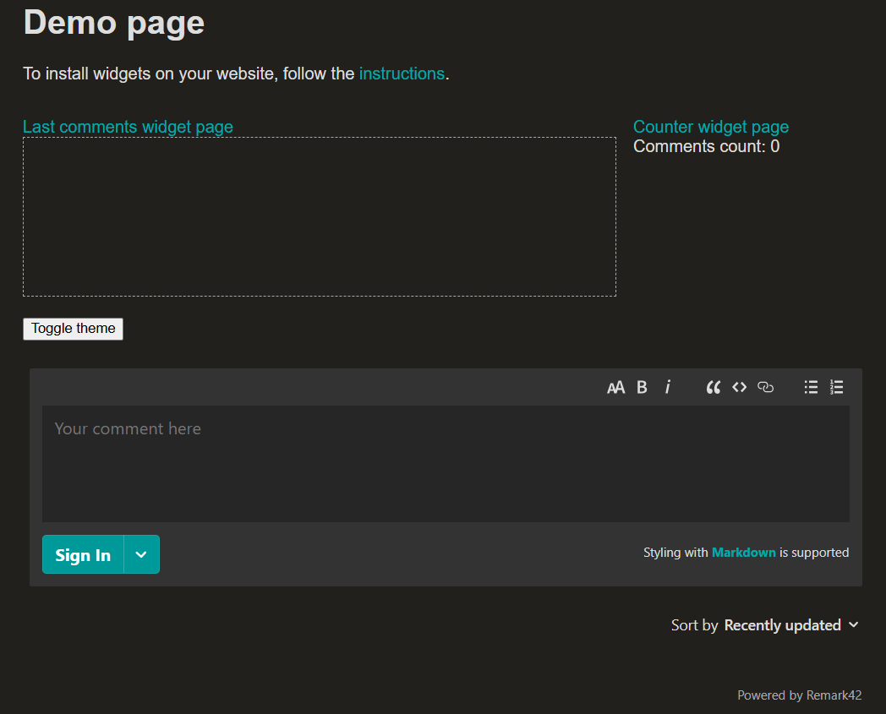

----------

Baru belajar bikin blog di [Hugo](https://gohugo.io/) jadinya kayak blog saya ini.
Pake tema dari [Mainroad](https://github.com/Vimux/Mainroad).

Aslinya pas setup awal hugo sama theme nya ini, postingan di blog belum bisa di kasi comment jadi rasanya kurang afdol aja gitu.
Lihat di dokumentasinya  [Hugo](https://gohugo.io/content-management/comments/), ternyata bisa integrasi ke layanan kayak [Disqus](https://disqus.com/) biar static site yang dibuat di hugo bisa dikirimin comment. 
<!--more-->
Sayangnya kalau pake `Disqus` itu semua data komentar dari pengunjung kesimpan di disqus dan mesti daftar lagi. Selain disqus ada beberapa alternatif mulai dari yang berbayar sampe yang gratisan dan open source pula. Setelah baca-baca akhirnya solusi untuk komentar pertama yang pengen saya coba itu [Remark42](https://remark42.com/). 

Alasan saya pilih Remark42 karna beberapa hal ini :
- Bisa di hosting di server sendiri.
- Bisa jalan di docker container (udah disiapin template docker compose nya pula).
- Dari dokumentasinya kelihatannya gak terlalu susah di config.

Jadi deh mutusin buat coba dulu Remark42 ini di Raspberry PI pake beberapa langkah utama di bawah :

## Siapin docker compose file

Pastiin docker udah ke install di servernya, kalau mau lihat cara setup dockernya nanti di postingan lain.
Docker udah keinstall, sekarang buat folder baru aja dulu, trus bikin file baru dengan nama compose.yaml
```bash
$ mkdir -p comments/var
$ cd comments
$ nano compose.yaml
```
File `compose.yaml` saya copy dari template yang disiapin sama [Remark42](https://github.com/umputun/remark42/blob/master/docker-compose.yml) nya, hanya tinggal cocokin beberapa aja, isi filenya kurang lebih kayak gini:

```bash
services:
  remark:
    image: ghcr.io/umputun/remark42:latest
    container_name: "remark42"
    hostname: "remark42"
    restart: always

    logging:
      driver: json-file
      options:
        max-size: "10m"
        max-file: "5"
    ports:
      - "806:8080"

    environment:
      - REMARK_URL=https://comments.imnoob.net/ # Sesuaikan dengan URL buat hosting Remark42 nya nanti
      - SECRET=secret-key
      - AUTH_GOOGLE_CID=google-client-id
      - AUTH_GOOGLE_CSEC=google-secret
      - AUTH_GITHUB_CID=github-client-id
      - AUTH_GITHUB_CSEC=github-secret
    volumes:
      - ./var:/srv/var
```
Beberapa hal yang saya sesuaikan di bagian :
- ports
- REMARK_URL
- SITE
- SECRET
- AUTH_GOOGLE_CID
- AUTH_GOOGLE_CSEC
- AUTH_GITHUB_CID
- AUTH_GITHUB_CSEC


## Jalanin docker nya

Untuk jalanin dockernya hanya dengan jalanin command :
```bash
$ docker compose up -d
```
Pertama kali jalan itu imagenya di download dulu jadi nunggu bentar, trus kalau udah kelar bisa jalanin command buat ngecek kalau dockernya jalan apa gak
```bash
$ docker ps
```
Sekalian jalanin command buat ngelihat log nya
```bash
$ docker logs remark42
```

## Setup reverse proxy di nginx

Saya pake reverse proxy biar Remark42 bisa diakses dari komputer/hp di jaringan rumah pake alamat yang disetting di docker compose.yaml bagian `REMARK_URL`. Setup nginxnya gak ditulis disini, nanti di postingan lain aja. langsung aja buat setup reverse proxynya :
- Buat file baru di folder `/etc/nginx/sites-available`
  ```bash
  $ sudo nano /etc/nginx/sites-available/comments.imnoob.net.conf
  ```
- Isi filenya gini:
  ```bash
  server {

    listen 80;
    listen 443 ssl;
    ssl_certificate ./fullchain.pem;
    ssl_certificate_key ./privkey.pem;

    server_name comments.imnoob.net;

    location / {
         proxy_set_header        X-Forwarded-Proto $scheme;
         proxy_set_header        X-Real-IP $remote_addr;
         proxy_set_header        X-Forwarded-For $proxy_add_x_forwarded_for;
         proxy_set_header        Host $http_host;
         proxy_pass              http://127.0.0.1:806;
     }
  }
  ```
- Buat softlink biar config di atas ke enable di nginxnya
  ```bash
  sudo ln -s /etc/nginx/sites-available/comments.imnoob.net.conf /etc/nginx/sites-enabled/comments.imnoob.net.conf
  ```
- Restart nginx nya biar settingan reverse proxynya ke apply
  ```bash
  $ sudo systemctl restart nginx
  ```
- Coba akses dari computer lain pake alamat di [REMARK_URL](https://comments.imnoob.net/web)

## Tambahin entrynya di cloudflare tunnel

Buat di cloudflare tunnel juga biar nanti kalau blognya di akses dari internet, juga bisa buat kirim komentar pake Remark42 ini.
- Buat dulu CNAME record baru di DNS servernya yang arahnya ke alamat cloudflare tunnel yang udah [disetup sebelumnya](/posts/akses-jaringan-rumah-dari-mana-saja-pake-cloudflare-tunnel/)
- Edit file config cloudflarednya tambahin ini:
  ```bash
  - hostname: comments.imnoob.net
    service: http://localhost:806
  ```
- Restart service cloudflared
  ```bash
  $ sudo systemctl restart cloudflared
  ```
- Sekarang Remark42 harusnya bisa diakses dari internet juga, test akses pake https://comments.imnoob.net/web/
- Harusnya tampilannya kayak gambar ini
  

## Update konfigurasi Hugo nya

Setelah remark42-nya udah jalan semua, selanjutnya config hugonya biar bisa muncul bagian untuk orang kirim komentar
- Edit file `./hugo.toml` trus tambahkan settingan di bawah
  ```toml
  [Params.remark42]
    enabled = true
    host ="https://comments.imnoob.net"
    site = "comments.imnoob.net"
    locale = "en"
  ```
- Trus di bagian `[Params]` tambahin `showAuthor: true` biar semua article defaultnya akan munculin kolom komentar
  ```toml
  [Params]
    ---
    showAuthors: true
    ---
  ```

## Buat partial baru untuk commentar

- Theme `Mainroad` sebenarnya sudah ada partial `comments.html` untuk tampilin komentar tapi kalau pake `Disquss` jadinya buat partial baru untuk override partial comments bawaan themenya
- Buat file baru di dalam folder `./layouts/partials` dengan nama `comments.html`, isi filenya:
  ```html
  {{- if (default .Site.Params.showComments .Params.showComments) -}}
  <hr>
  <p>
      <b>Tinggalin komentar yah gaes !</b><br>
  </p>
  <div id="remark42"></div>
  <script>
      var remark_config = {
          host: '{{ .Site.Params.remark42.host }}',
          site_id: '{{ .Site.Params.remark42.site }}',
          components: ['embed','counter','last-comments'],
          url: '{{ $.Permalink }}',
          theme: 'light',
          max_shown_comments: 100,
          show_email_subscription: true,
          simple_view: false,
          no_footer: true,
      };

      !function(e, n) {
          for (var o = 0; o < e.length; o++) {
              var r = n.createElement('script'),
              c = '.js',
              d = n.head || n.body;
              'noModule' in r ? (r.type = 'module', c = '.mjs') : r.async = !0, r.defer = !0, r.src = remark_config.host + '/web/' + e[o] + c, d.appendChild(r)
          }
      }(remark_config.components || ['embed'], document);
  </script>

  {{- end -}}
  ```
- Kalau gak mau munculin komentar di postingan, front matter dari postingannya tambahin :
  ```toml
  showComments: false
  ```
---------

## Penutup

Udah deh selesai, kolom komentar di postingan ini tuh pake Remark42 ini, tinggalin komentar kalau ada yang perlu dikoreksi atau barangkali ada yang mau ditanyain yah. Terima kasih kaka bos.

