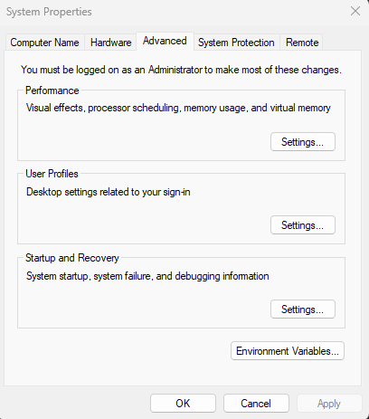

----------

Selama ini power bi reportnya user kan di publish ke Report Server on-premise. Tapi baru-baru ini ada yang butuh power bi reportnya biar bisa di akses dari internet termasuk dari HP gitu. Pake on-premise report server bisa aja sih sebenernya, cuma mesti connect VPN dulu dan harus registrasi devicenya kemana-mana. Akhirnya reportnya dipublish ke Power BI Service.
<!--more-->
Pas udah publish, kendala berikutnya data sourcenya ada di on-premise server, ada yang dari file excel di shared folder, ada yang di database yang di on-premise juga. Jadi perlu setup [on-premise data gateway](https://learn.microsoft.com/en-us/power-bi/connect-data/service-gateway-onprem) di salah satu PC atau server buat jadi gateway dari power bi reportnya untuk connect ke data source lokalan.

Aku udah berhasil setup juga sih on-premise data gatewaynya, tapi report yang dipublish ini tuh data sourcenya dari oracle, dan usernya connect ke oraclenya itu pake alias yang disimpen di file `tnsnames.ora`. Problemnya, pada saat mau coba connect ke data sourcenya dari [Power BI Service](https://app.powerbi.com) gak bisa connect ke data source aliasnya, muncul error gini:

```
ORA-12154: Cannot connect to database. Cannot find alias NAMAALIAS in DataSources, , EZConnect.\r\nhttps://docs.oracle.com/error-help/db/ora-12154/

```
Padahal kalau dari local server bisa aja connect ke data sourcenya pake nama alias ini. Setelah cari-cari ternyata penyebabnya itu karna environment variable `TNS_ADMIN` buat lookup ke file `sqlnet.ora` sama `tnsnames.ora` defaultnya hanya melekat ke user yang dipake untuk install Oracle Clientnya, sedangkan service account buat jalanin service on-premise data gateway itu beda.

Jadi solusinya ada dua:
1. Ganti service account untuk on-premise data gatewaynya biar run as account yang dipake untuk install oracle client (tapi ini kurang direkomendasikan)
2. Buat aja environment variable `TNS_ADMIN` yang baru tapi di level system jadi biar berlaku untuk semua user. caranya :
   - Pastikan dulu user yang di pake buat edit environment variable itu punya local admin permission ke windowsnya
   - Trus klik `Start Menu` trus ketik aja `env` atau `environment variable` trus pilih `Edit the system evironment variable`
   - Nanti muncul gambar di bawah, klik di `Environment Variable`
      
   - Setelah itu Klik `New` bagian bawah di tampilan berikutnya 
      
   - Isikan `Variable name` sama `Variable value` kayak dibawah, tapi variable value disesuaikan aja dengan folder tempat file `sqlnet.ora` sama `tnsadmins.ora` nya
      
   - Trus klik `OK`

Setelah environment variablenya dibuat, restart dulu service On-premise data gateway. Trus balik lagi ke settingan Power BI reportnya di http://app.powerbi.com, cek dulu status on-premise data gatewaynya pastiin sudah online baru coba lagi connect ke data source pake nama alias, harusnya sudah bisa.

----------

Silahkan tinggalin komentar kalau ada yang mau ditanyain. Terima kasih.