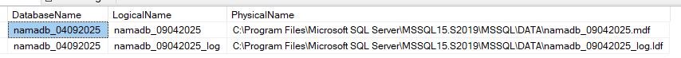
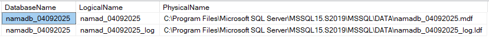

----------
Saya diminta buat restore database production ke server development dengan nama database baru pake tanggal hari kemarin. Tapi pas restore databasenya, saya salah ketik nama tanggalnya jadi bukannya pake tanggal kemarin `namadb_04092025` malah kebalik bulan sama tanggalnya jadi saya bikin nama databasenya jadi `namadb_09042025`.
<!--more-->
Bisa aja sih connection string di aplikasinya disesuaikan dengan nama database yang saya buat ini, cuma biar lebih memudahkan tracking, developernya minta buat direname aja nama databasenya pake nama yang sesuai dengan permintaan.

## Rename databasenya pake sp_renamedb
Cukup jalanin SQL statement dibawah buat rename dari `namadb_09042025` ke `namadb_04092025`
```sql
USE [master]
GO
ALTER DATABASE [namadb_09042025] SET SINGLE_USER WITH ROLLBACK IMMEDIATE
GO
EXEC sp_renamedb 'namadb_09042025', 'namadb_04092025'
GO
ALTER DATABASE [namadb_04092025] SET MULTI_USER
GO
```
Nama databasenya berubah jadi sesuai dengan permintaan, tapi logical name sama physical namenya masih aja tetep seperti sebelumnya, jadi perlu disesuaikan juga. Ini gak harus sih tapi biar konsisten aja

## Rename logical dan physical file
1. Cek dulu nama logical file sama lokasi fisik data filenya pake query di bawah:
   ```sql
   USE [master]
   GO
   SELECT
     b.name AS DatabaseName
     ,a.name AS LogicalName
     ,a.physical_name AS PhysicalName
   FROM sys.master_files a
     JOIN sys.databases b on a.database_id = b.database_id
   WHERE b.name = 'namadb_04092025'
   GO
   ```
   Hasilnya kayak gini :
   

2. Rename logical filenya
   ```sql
   USE [master]
   GO
   ALTER DATABASE [namadb_04092025] SET SINGLE_USER WITH ROLLBACK IMMEDIATe
   GO
   ALTER DATABASE [namadb_04092025] MODIFY FILE (NAME = N'namadb_09042025', NEWNAME = N'namad_04092025')
   GO
   ALTER DATABASE [namadb_04092025] MODIFY FILE (NAME = N'namadb_09042025_log', NEWNAME = N'namad_04092025_log')
   GO
   ALTER DATABASE [namadb_04092025] SET MULTI_USER
   GO
   ```
   Setelah jalanin query di atas, jalanin lagi query di langkah sebelumnya untuk cek logical file namenya harusnya udah berubah.
3. Rename physical file
  - Database nya di detach dulu
    ```sql
    USE [master]
    GO
    ALTER DATABASE [namadb_04092025] SET SINGLE_USER WITH ROLLBACK IMMEDIATe
    GO
    EXEC sp_detach_db @dbname = N'namadb_04092025'
    GO
    ```
  - Buka file explorer ke folder path tempat physical file dari databasenya, trus rename pake nama yang sesuai
    ```PowerShell
    > namadb_09042025.mdf --> namadb_04092025.mdf
    > namadb_09042025_log.ldf --> namadb_04092025.ldf
    ```
4. Attach kembali physical filenya pake nama file yang baru
   ```sql
   USE [master]
   GO
   CREATE DATABASE [namadb_04092025] ON
    (FILENAME = N'C:\Program Files\Microsoft SQL Server\MSSQL15.S2019\MSSQL\DATA\namadb_04092025.mdf'),
    (FILENAME = N'C:\Program Files\Microsoft SQL Server\MSSQL15.S2019\MSSQL\DATA\namadb_04092025_log.ldf')
   FOR ATTACH
   GO
   ```
5. Cek lagi logical sama physical filenya
   ```sql
   USE [master]
   GO
   SELECT
     b.name AS DatabaseName
     ,a.name AS LogicalName
     ,a.physical_name AS PhysicalName
   FROM sys.master_files a
     JOIN sys.databases b on a.database_id = b.database_id
   WHERE b.name = 'namadb_04092025'
   GO
   ```
   Hasilnya kayak gini :
   
6. Balikin database nya ke mode MULTI_USER
   ```sql
   ALTER DATABASE [namadb_04092025] SET MULTI_USER
   ```

--------

## Penutup
Udah selesai proses rename databasenya. Simple aja kan. tinggalin komentar kalau ada yang mau ditanyain yah. Terima kasih!