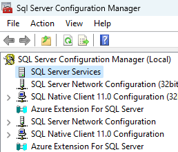
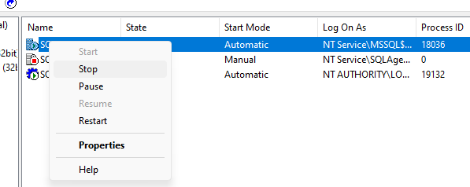
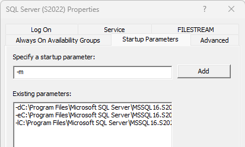

----------

Masih pagi-pagi udah ditelpon sama temen, katanya dia gak bisa login ke sql servernya karna passwordnya salah dan dia udah gak inget lagi mana password yang bener. Udah coba macam-macam password yang dia inget tapi gak ada satupun yang bisa. Remote ke server trus connect pake Windows Authentication, bisa sih tapi usernya gak punya role `sysadmin1, dia lupa dulu waktu install itu user mana yang dijadiin sysadmin.
<!--more-->
Untungnya user yang dia pake buat remote ke server itu punya privilege local admin di windows servernya. Ya udah langsung aja cuss buat reset password user 'sa' sekalian grant user AD nya biar punya `sysadmin` role di sql server

### Stop dulu service SQL Server instancenya
1. Jalanin aplikasi SQL Server Configuration Manager
2. Pilih SQL Server Services

   
3. Klik kanan di nama service untuk sql server instancenya trus klik stop
   

### Start SQL Server - single user mode
Untuk jalanin SQL server Instancenya di single user mode ada dua cara
**Pertama dari SQL Server Configuration Manager**
1. Klik kanan nama service --> Properties
2. Pindah ke tab Startup Parameters trus di bagian Specify a startup parameter, ketik -m trus kik Add

   
3. Setelah masuk startup parameternya klik OK
4. Klik kanan nama servicenya trus start

**Cara kedua dari command prompt atau PowerShell**
1. Jalanin command prompt as Administrator
2. Langsung aja ketik perintah buat start service sql servernya tapi tambahin parameter untuk single user modenya
   ```PowerShell
   net start "SQL Server (MSSQLSERVER)" /m
   ```
   Kalau nama instancenya bukan default berarti disesuaikan saja, misalnya nama instancenya `SQLPRD` berarti command buat start nya menjadi :
   ```PowerShell
   net start "SQL Server (SQLPRD)" /m
   ```

### Connect ke sql server
Untuk connect ke SQL Server instance yang udah jalan di single user mode, langsung aja dari powershell atau command prompt yang udah di run as admin trus ketik :
```PowerShell
sqlcmd -S "LOCALHOST\NAMAINSTANCE"
```
### Grant sysadmin Server role
Setelah masuk ke sqlcmd promptnya, langsung aja ketik perintah :
```sql
USE [master]
GO
CREATE LOGIN [DOMAIN\namauser] FROM WINDOWS
GO
ALTER SERVER ROLE [sysadmin] ADD MEMBER [DOMAIN\namauser]
GO
```
### Reset password User 'sa'
Lanjut kalau mau reset password user `sa` nya
```sql
USE [master]
GO
ALTER LOGIN [sa] WITH PASSWORD = N'password-baru', CHECK_POLICY=OFF, CHECK_EXPIRATION=OFF
GO
```
### Stop lagi sql server instancenya
Lanjut stop lagi sql server instancenya
1. Dari SQL Server Configuration Manager, klik kanan nama Service trus stop
2. Dari PowerShell atau Command Prompt
   ```PowerShell
   net stop "SQL Server (SQLPRD)"
   ```

### Start lagi di normal mode
Lanjut start lagi SQL server instancenya di normal mode
1. Dari SQL Server Configuration Manager
   - Klik kanan nama service - Properties
   - Pindah ke tab `Startup Paremeters`
   - Pilih Startup Parameter yang dibuat untuk single user mode tadi
   - Klik `Remove`
   - Trus klik `OK`
   - Klik kanan nama service trus start
2. Dari Command Prompt
   ```PowerShell
   net start "SQL Server (SQLPRD)"
   ```

--------

### Penutup
Udah selesai, sekarang bisa lagi harusnya login ke SQL Server instance pake password baru untuk user `sa` atau bisa juga pake windows authentication untuk user yang di grant sysadmin role tadi. Silahkan tinggalin komentar kalau ada yang mau ditanyain yah. Terima kasih :smiley: